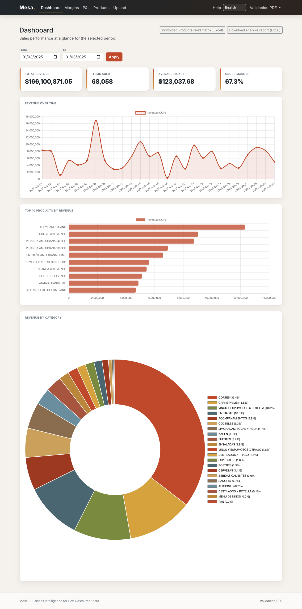
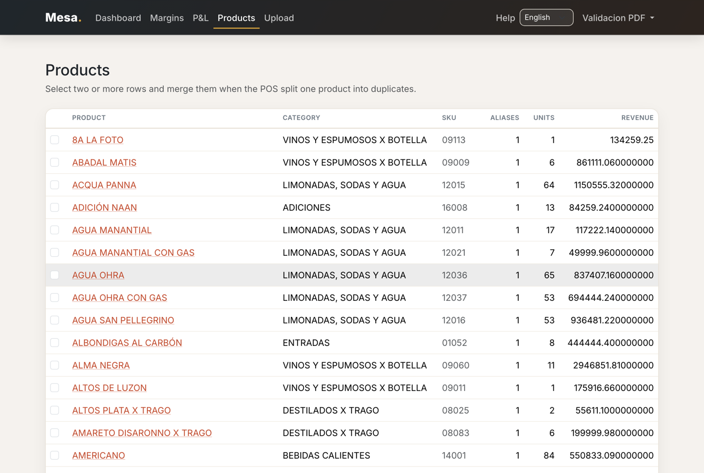
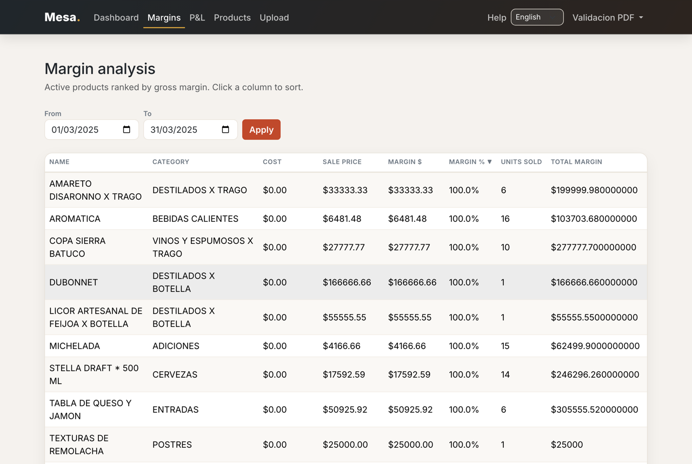
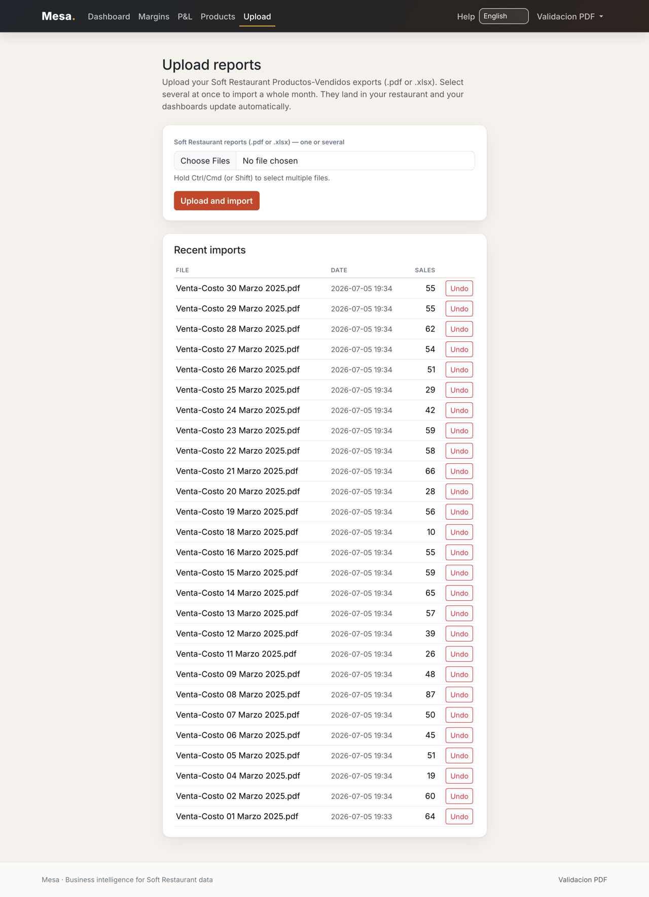
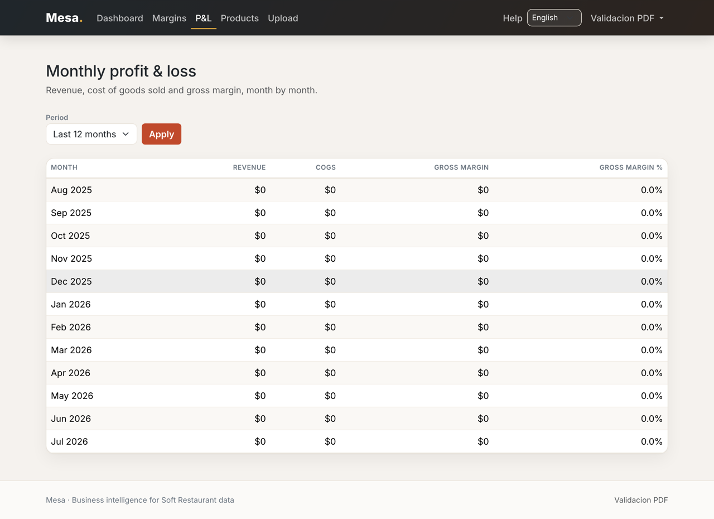
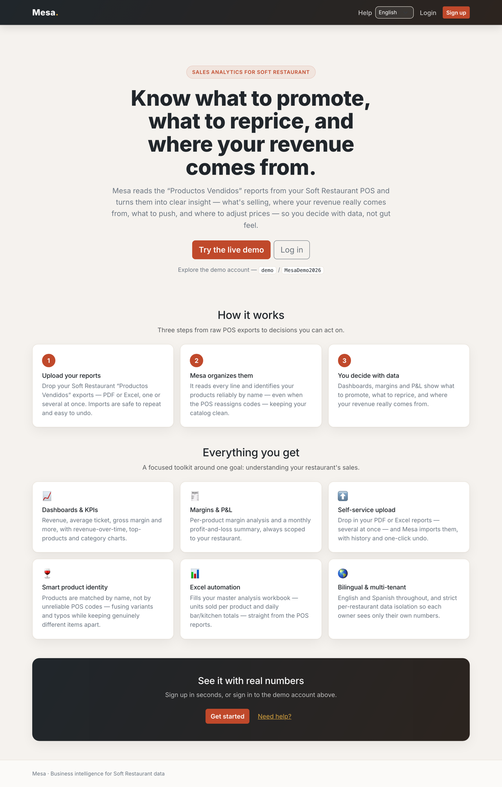
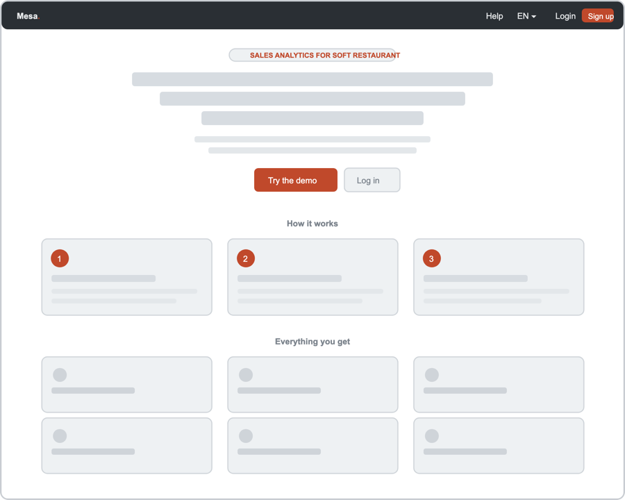
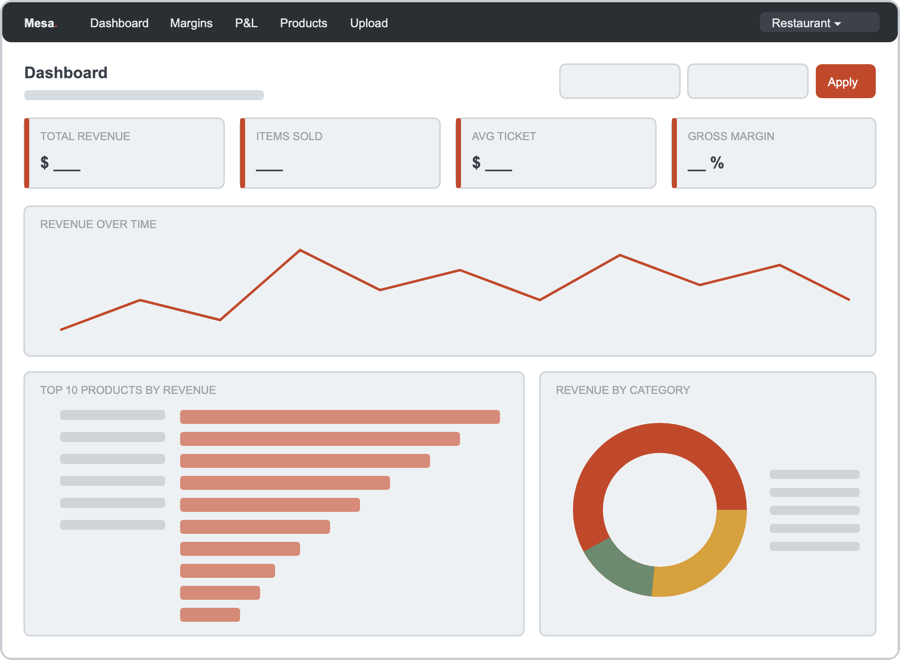
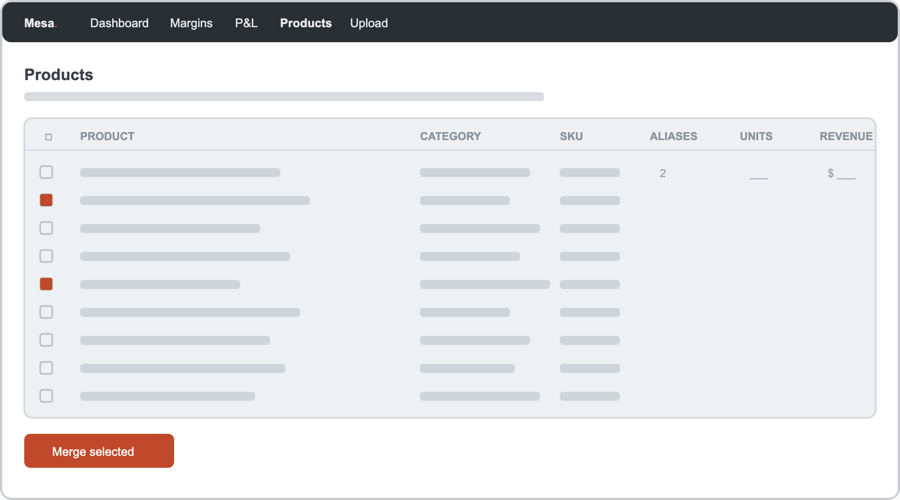
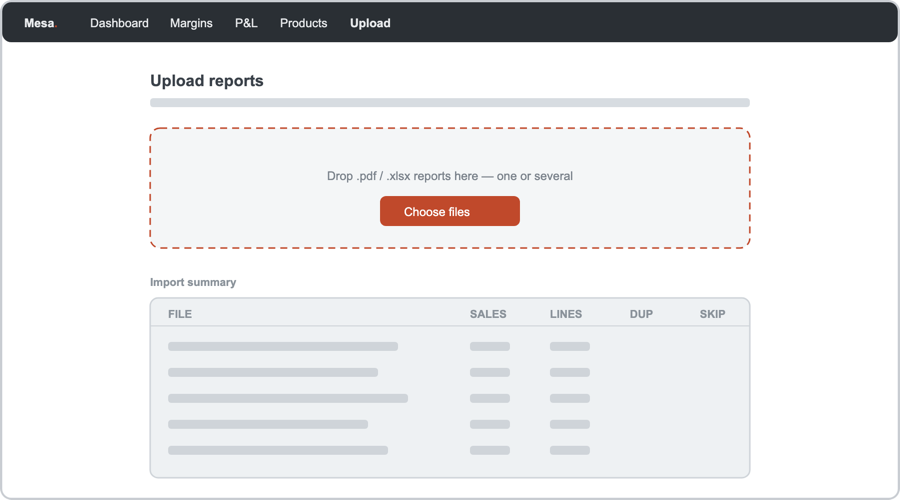

# Mesa 🍽️

**Sales analytics for restaurants running the [Soft Restaurant](https://softrestaurant.com/) POS.**
Mesa reads the "Productos Vendidos" sales reports your POS already produces and turns
them into decisions: **what to promote, where to adjust prices, and where your revenue
really comes from** — so you run on data, not gut feel.

[](https://github.com/madlp24/mesa/actions/workflows/ci.yml)


### ▶ Live demo — <https://mesa-345-ab00ff997aa2.herokuapp.com/>

Try it with the demo account **`demo` / `MesaDemo2026`**, or sign up and upload your own
Soft Restaurant reports.

---

## Why Mesa exists

I'm **Miguel De La Pava**, founder of **Tres Cuatro Cinco**, a steakhouse. Every month
we analyzed our sales by hand — copying the POS "Productos Vendidos" report into a
spreadsheet, product by product — just to see what sold, what to push, and where to
adjust prices. It was slow and easy to get wrong.

Every restaurant on Soft Restaurant gets the **exact same reports**. So Mesa isn't a
one-off spreadsheet — it's a **multi-tenant product**: any restaurant signs up, uploads
its reports, and gets the analysis automatically.

## What it does

- 📈 **Dashboards & KPIs** — revenue, average ticket, gross margin and units, with
  revenue-over-time, top-products and revenue-by-category charts. *See where your money
  comes from.*
- 💰 **Margins & P&L** — per-product margin analysis and a monthly profit-and-loss
  summary. *Know what to reprice.*
- 🧾 **Self-service upload** — drop your `.pdf` / `.xlsx` "Productos Vendidos" exports,
  **one or several at once**; re-imports are idempotent, with an import history and
  one-click **undo**.
- 🧠 **Reliable product identity** — POS codes get reassigned and duplicated, so Mesa
  identifies products **by name**, fusing variants (typos, word order, unit markers)
  while keeping genuinely different items apart. Fix any edge case from the UI (merge,
  re-point, split).
- 📊 **Master-workbook automation** — fills the owner's real Excel workbook: the
  "Productos vendidos" units matrix and the "Datos totales" Bar/Kitchen figures, read
  straight from each report.
- 🌐 **Multi-tenant & bilingual** — each restaurant sees only its own data; the whole UI
  is available in **English and Spanish**.

## How it works

1. **Upload your reports** — PDF or Excel, one or many.
2. **Mesa organizes them** — every line is parsed and matched to the right product by
   name, keeping your catalog clean even as POS codes change.
3. **You decide with data** — dashboards, margins and P&L show what to promote, what to
   reprice, and where revenue comes from.

## Screenshots

Or explore the **[live demo](https://mesa-345-ab00ff997aa2.herokuapp.com/)**
(`demo` / `MesaDemo2026`).

**Dashboard** — KPIs, revenue-over-time, top products and category mix, from real sales:



<table>
  <tr>
    <td width="50%"><br><sub><b>Products</b> — merge / re-point / split identities</sub></td>
    <td width="50%"><br><sub><b>Margins</b> — per-product margin analysis</sub></td>
  </tr>
  <tr>
    <td width="50%"><br><sub><b>Upload</b> — several reports at once, with history + undo</sub></td>
    <td width="50%"><br><sub><b>P&amp;L</b> — monthly profit &amp; loss</sub></td>
  </tr>
</table>

**Landing page:**



## Wireframes

The low-fidelity layouts the interface was built from (sources in
[`docs/wireframes/`](docs/wireframes)):

<table>
  <tr>
    <td width="50%"><br><sub>Landing</sub></td>
    <td width="50%"><br><sub>Dashboard</sub></td>
  </tr>
  <tr>
    <td width="50%"><br><sub>Products</sub></td>
    <td width="50%"><br><sub>Upload</sub></td>
  </tr>
</table>

## Architecture highlights

The parts worth a closer look:

- **Name-based product identity** (`catalog/identity.py`) — the POS `clave` is not a
  reliable key (it gets reassigned and duplicated), so identity is resolved by a
  normalized **name**. A `ProductResolver` fuses obvious variants (word order, typos,
  `*GR`/`ML` markers, `"X Trago"`, same-code prefixes like *Negroni → Negroni Tanqueray*)
  while keeping distinct products apart (different age/size, bottle vs glass). Each
  `(code, name)` pair is recorded once as a `ProductAlias`.
- **Pluggable importers** (`sales/importers/`) — `BaseImporter.normalize()` is the
  contract; concrete importers self-register by extension and are auto-discovered, so a
  **new report format is one new file**, no core edits. `persist()` is idempotent by
  `external_id`.
- **Multi-tenancy** — shared-DB, row-level scoping. A middleware resolves
  `request.restaurant`; every model, query, service and export is scoped to one tenant,
  with per-restaurant uniqueness. Isolation is covered by tests.
- **Excel automation** (`analytics/unified_excel.py`) — openpyxl, aware of the real
  workbook's two-row (year / month) header; writes a **copy**, never the original,
  matches rows by name, and preserves per-row formulas.
- **Quality gate** — `pytest` with a **70% coverage floor** (currently ~88%) enforced in
  GitHub Actions CI on every push.

## Tech stack

**Backend** Django 5 · Python 3.12 · PostgreSQL (SQLite locally) ·
[django-allauth](https://allauth.org/) ·
**Data** openpyxl · pdfplumber · **Frontend** Bootstrap 5 · Chart.js · Django i18n ·
**Ops** Heroku · GitHub Actions CI · pytest · ruff.

## Local setup

Running locally takes about five minutes.

**Prerequisites:** Python 3.12 (the project pins `python-3.12.7`; 3.11+ works for dev)
and git.

```bash
git clone https://github.com/madlp24/mesa.git
cd mesa

python3 -m venv .venv
source .venv/bin/activate            # Windows: .\.venv\Scripts\Activate.ps1

pip install -r requirements-dev.txt  # tests + linters included

cp .env.example .env                 # Windows: Copy-Item .env.example .env
python -c "import secrets; print(secrets.token_urlsafe(50))"   # paste as SECRET_KEY in .env

python manage.py migrate
python manage.py createsuperuser
python manage.py runserver
```

The app is now at <http://127.0.0.1:8000/> (admin at `/admin/`). `.env` is gitignored
and read via `python-decouple`; the defaults use a local SQLite database.

To build the Spanish translation catalog (needs GNU `gettext`:
`brew install gettext` / `apt-get install gettext`):

```bash
python manage.py compilemessages
```

## Loading data

Upload from the **Upload** page in the app, or from the command line:

```bash
python manage.py import_sales --file <report.pdf|.xlsx> --restaurant <slug>
```

`--restaurant` is optional when only one restaurant exists.

### Excel exports & master-workbook updates

```bash
# Export fresh workbooks from the data (also available as dashboard downloads)
python manage.py export_excel --type matrix  --output productos_vendidos.xlsx
python manage.py export_excel --type report  --output analisis.xlsx --start 2026-01-01 --end 2026-12-31

# Fill one month's units into an existing "Productos vendidos" matrix (writes a COPY)
python manage.py update_unified --file "Análisis unificado.xlsx" --restaurant <slug> --year 2025 --month 3

# Fill "Datos totales" Bar/Kitchen figures (N/O/S/T) from a folder of daily PDFs
python manage.py update_datos_totales --file "Análisis unificado.xlsx" --pdf-dir "VENTA COSTO 2025/MARZO"
```

Every workbook command writes to a **copy**, never the original, matches rows by name,
and preserves historical codes and formulas.

## Testing & CI

```bash
python -m pytest -q     # full suite, coverage floor 70% (currently ~88%)
ruff check .            # lint
```

CI runs the same checks on every push ([workflow](.github/workflows/ci.yml)).

## Project management

Built story-by-story with a Kanban board and one issue per user story. See the
[**project board**](https://github.com/users/madlp24/projects/6) and the
[Project Index](https://github.com/madlp24/mesa/issues/21) (user stories, sprint plan,
and commit convention). Every story ships as its own PR with tests.

## Author

**Miguel De La Pava** — founder, Tres Cuatro Cinco Steakhouse.
GitHub [@madlp24](https://github.com/madlp24) · <mdelapavalondono@gmail.com>

© 2026 Miguel De La Pava. Portfolio project.
